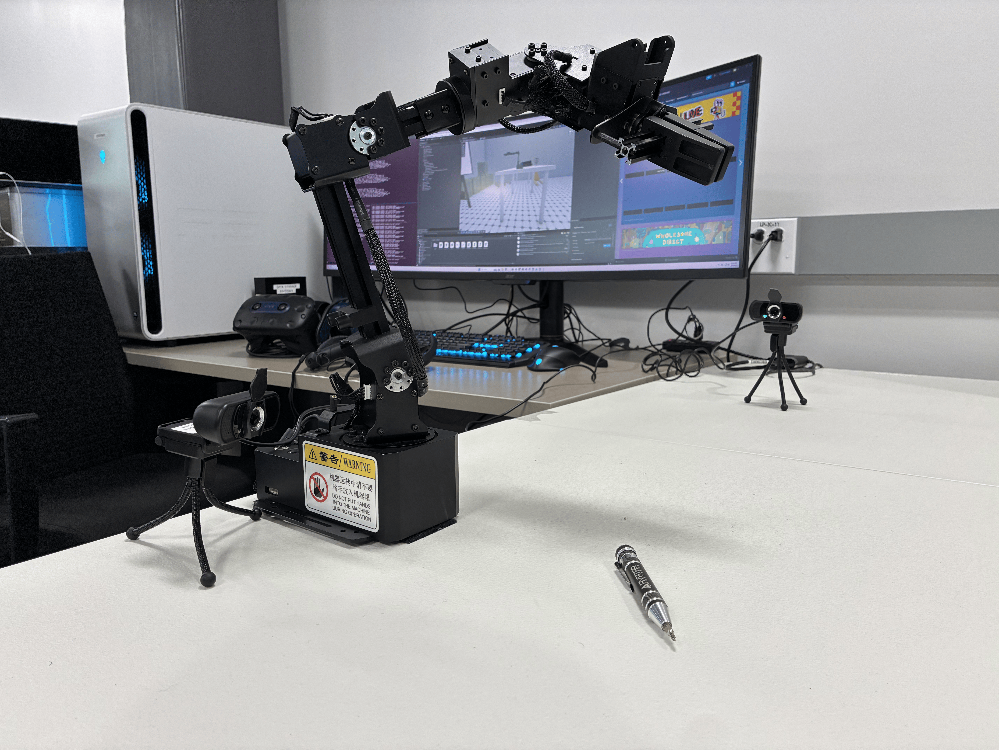

# **Digital Twin Robot Arm in ROS Noetic**
---
# **Purpose**


This repo is a collection of `ROS Noetic` nodes and library references for a digital twin of the 6-DOF `NXROBO Sagittarius` robot arm. It's for owners of the arm who want to control the robot through a virtual reality interface run by `Unity`.

This is repo attempts to **democratize technology,** where any operator unlimited by skill or experience can contribute to useful work. Although the US would find this is worth addressing, any nation can benefit from interfaces, particularly intuitive and affordable VR interfaces, that lower the barrier to entry for meaningful contribution in robotics and tech.

This project was a 10-week **REU** (Research Experience for Undergraduates) program at **Kent State University** within Kent State's XR Lab and is funded by grants from the National Science Foundation.

 

## Getting Started

Requirements:
> `WSL2` running `Ubuntu-20.04`  
> `ROS Noetic` installed onto `WSL2`

Clone repository:
```
git clone https://github.com/AidanWoodard/VR-Enabled-Digital-Twin.git
```

Start new build:
```
catkin_make  
source ./devel/setup.bash
```

Connecting to Unity:
```
roslaunch ros_tcp_endpoint endpoint.launch
```

To run a fully-enabled system, it is ***STRONGLY SUGGESTED*** to copy the contents of the bash helper functions into your `WSL2` bash_rc, as they are a list of custom functions to streamline process on startup.
```
cat ~/PATH/TO/FILE/docs/ExtraReference/CUSTOM_BASHRC_FUNCTIONS.md >> ~/.bashrc  
```
Launch full system with custom bash_rc command:
```
fullsyslaunch
```
## Features

### Live Camera Feeds

Two live webcam feeds controlled by individual `ROS` nodes output a live feed that is listened for in the Unity VR scene. The camera startup sequence is automatically staggered to prevent crowding the bus when porting from Windows or MacOS into `WSL2`.

**Windows Powershell Startup (elevated)**
```
usbipd list  
usbipd bind -b <bus_id>  
usbipd attach -w -b <bus_id>
```
> Select the bus_id of the webcam, repeat process for second webcam.

Test with:
```
rosrun rviz rviz
```
> **Add New** by topic. Select **Camera** node to subscribe to feed.  

### Robot VR Dashboard

The robot dashboard, visible in the VR Unity scene as an interactive dashboard, allows the operator to easily record, save, and playback robot motion in `ROS`-friendly `.bag` file format.

This is controlled with a `ROS` *multiplexer* (MUX) node that manages switching automatically between listening for operator control and playback states. 
> This node is found under **arm_bag_recorder.py** in the unity_vr_control/ subfolder.

### **Remote Capabilities**

By changing the target IP address in the `ROS` TCP endpoint to be a separate computer running the VR Unity scene, the operator can effectively control the robot remotely through the VR interface. In practice, this was accomplished with a physical ethernet Cat-6 cable connecting the two computers, and fully virtual operation has not yet been tested. *(see Future Work below)*

## **Future Work**

### **Additions to Remote Capabilities**

Operating remotely in a democratized workspace is the final goal of this project, as any operator regardless of skill or location could control and program a 6-DOF robot arm with an internet connection, computer, and VR headset/controls. 

Though achieved with an ethernet cable, this has yet to be done wirelessly.

### **More Safety Redundancy**

Further efforts should be implemented on the `ROS` side of development to prevent self-collision and collision with any floor surfaces. This is partly accomplished with the `MoveIt` library but could be more properly implemented.

## **Where to Go Next**

See extra documentation under **docs/** folder.

## **Credits**

Previous work included in this repository:

> Base ROS packaging, robot URDF descriptions, and `MoveIt` config by **NXROBO**:  
> https://github.com/NXROBO/sagittarius_ws/tree/main  
> Digital Twin through VR interaction by **Samuel Staciewicz**:  
> https://github.com/samuelstasiewicz/VR-Enabled-Teleoperation  
 
---
Thank you to **Kent State University** and the **College of Aeronautics and Engineering** for this REU program opportunity. Thanks also to Dr. Benjamin Kwasa for his guidance in the Kent State XR Laboratory.
